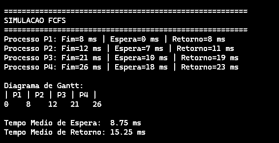
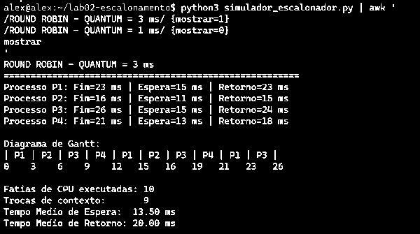
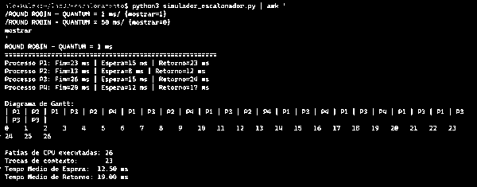
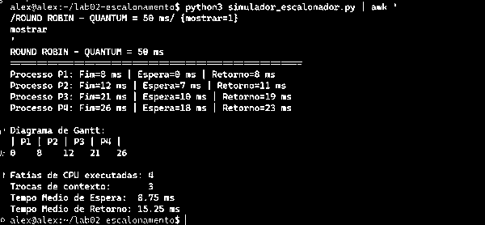

# Laboratório 02 — Simulação e Avaliação de Desempenho de Algoritmos de Escalonamento de CPU

Disciplina: Sistemas Operacionais  
Curso: Análise e Desenvolvimento de Sistemas (ADS)  
Semestre: 2026.2

## Objetivo

Simular e analisar algoritmos de escalonamento de CPU, observando como diferentes políticas influenciam o tempo de espera, o tempo de retorno e a quantidade de trocas de contexto.

Foram analisados:

- **FCFS (First-Come, First-Served)** — não-preemptivo;
- **Round Robin (RR)** — preemptivo por quantum;
- **SJF (Shortest Job First)** — não-preemptivo, resolvido manualmente.

## Carga de trabalho

| Processo | Chegada | Duração/Burst |
|---|---:|---:|
| P1 | 0 ms | 8 ms |
| P2 | 1 ms | 4 ms |
| P3 | 2 ms | 9 ms |
| P4 | 3 ms | 5 ms |

## Estrutura do repositório

```text
lab02-escalonamento/
├── simulador_escalonador.py
├── resultado_lab02.txt
├── evidencias/
│   ├── 01_fcfs.png
│   ├── 02_round_robin_q3.png
│   ├── 03_quantum_1ms.png
│   └── 04_quantum_50ms.png
└── README.md
```

## 1. FCFS e efeito comboio

No FCFS, os processos são atendidos na ordem de chegada:

```text
P1 → P2 → P3 → P4
```

Diagrama de Gantt:

```text
0        8    12         21     26
|   P1   | P2 |    P3    |  P4  |
```

Resultados:

| Processo | Fim | Espera | Retorno |
|---|---:|---:|---:|
| P1 | 8 ms | 0 ms | 8 ms |
| P2 | 12 ms | 7 ms | 11 ms |
| P3 | 21 ms | 10 ms | 19 ms |
| P4 | 26 ms | 18 ms | 23 ms |

- **Tempo médio de espera:** 8,75 ms
- **Tempo médio de retorno:** 15,25 ms



### Efeito comboio

O processo P2 chega no instante **1 ms** e precisa de apenas **4 ms** de CPU. Entretanto, como o FCFS é não-preemptivo, P1 continua usando a CPU até o instante **8 ms**.

Assim:

```text
P2 chega:   1 ms
P2 começa:  8 ms
Espera:     7 ms
```

Isso demonstra o **efeito comboio**: um processo mais longo que chegou primeiro faz com que processos menores aguardem atrás dele.

## 2. Round Robin — quantum de 3 ms

Com quantum igual a 3 ms, a sequência observada foi:

```text
P1 → P2 → P3 → P4 → P1 → P2 → P3 → P4 → P1 → P3
```

Resultados:

- **Fatias de CPU:** 10
- **Trocas de contexto:** 9
- **Tempo médio de espera:** 13,50 ms
- **Tempo médio de retorno:** 20,00 ms



## 3. Variação do quantum

### Quantum = 1 ms

Com quantum reduzido para 1 ms:

- **Fatias de CPU:** 26
- **Trocas de contexto:** 23
- **Tempo médio de espera:** 12,50 ms
- **Tempo médio de retorno:** 19,00 ms



A redução do quantum aumenta a frequência de preempções e, consequentemente, a quantidade de trocas de contexto. Isso tende a favorecer a responsividade, mas aumenta o overhead de escalonamento.

### Quantum = 50 ms

Com quantum de 50 ms:

- **Fatias de CPU:** 4
- **Trocas de contexto:** 3
- **Tempo médio de espera:** 8,75 ms
- **Tempo médio de retorno:** 15,25 ms



Como o quantum de 50 ms é maior que a duração de todos os processos dessa carga, cada processo termina antes de ser preemptado. Por isso, nesta situação, o Round Robin se comporta de forma equivalente ao FCFS.

### Comparação da variação do quantum

| Quantum | Fatias de CPU | Trocas de contexto | Espera média | Retorno médio |
|---|---:|---:|---:|---:|
| 1 ms | 26 | 23 | 12,50 ms | 19,00 ms |
| 3 ms | 10 | 9 | 13,50 ms | 20,00 ms |
| 50 ms | 4 | 3 | 8,75 ms | 15,25 ms |

## 4. Resolução manual do SJF não-preemptivo

No instante 0, somente P1 está disponível, portanto ele precisa ser executado primeiro.

Após P1 terminar no instante 8 ms, P2, P3 e P4 já chegaram. O SJF escolhe o menor burst disponível:

```text
P2 = 4 ms
P4 = 5 ms
P3 = 9 ms
```

Logo, a ordem é:

```text
P1 → P2 → P4 → P3
```

Diagrama:

```text
0        8    12     17          26
|   P1   | P2 |  P4  |     P3     |
```

Cálculos:

| Processo | Chegada | Duração | Início | Fim | Espera | Retorno |
|---|---:|---:|---:|---:|---:|---:|
| P1 | 0 | 8 | 0 | 8 | 0 | 8 |
| P2 | 1 | 4 | 8 | 12 | 7 | 11 |
| P4 | 3 | 5 | 12 | 17 | 9 | 14 |
| P3 | 2 | 9 | 17 | 26 | 15 | 24 |

Tempo médio de espera:

```text
(0 + 7 + 9 + 15) / 4 = 7,75 ms
```

Tempo médio de retorno:

```text
(8 + 11 + 14 + 24) / 4 = 14,25 ms
```

## 5. Comparação entre os algoritmos

| Algoritmo | Espera média | Retorno médio |
|---|---:|---:|
| FCFS | 8,75 ms | 15,25 ms |
| Round Robin (3 ms) | 13,50 ms | 20,00 ms |
| SJF não-preemptivo | 7,75 ms | 14,25 ms |

Para esta carga específica, o SJF apresentou as menores médias de espera e retorno. Isso não significa que o Round Robin seja inadequado: seu objetivo é distribuir a CPU em fatias de tempo e melhorar a responsividade em sistemas interativos.

## Conclusão

O laboratório mostrou que a política de escalonamento influencia diretamente o comportamento dos processos. O FCFS é simples, mas pode apresentar efeito comboio. O Round Robin distribui a CPU por meio de quantum e sua quantidade de trocas de contexto depende fortemente do tamanho dessa fatia. Já o SJF, nesta carga específica, apresentou os menores tempos médios de espera e retorno.

Também foi possível observar que diminuir excessivamente o quantum aumenta as trocas de contexto, enquanto um quantum muito grande faz o Round Robin se aproximar do comportamento do FCFS.
